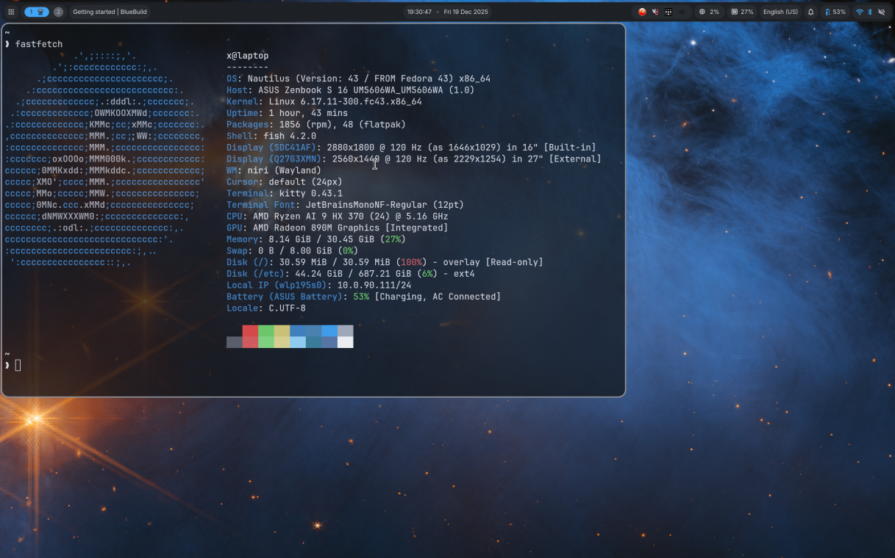

# nautilus &nbsp; [](https://github.com/commit2main/nautilus/actions/workflows/build.yml)

Opinionated Fedora Atomic niri image.



## Installation

To rebase an existing atomic Fedora installation to the latest build:

- First rebase to the unsigned image, to get the proper signing keys and policies installed:

  ```sh
  sudo bootc switch ghcr.io/commit2main/nautilus:latest
  ```

- Reboot to complete the rebase:

  ```sh
  systemctl reboot
  ```

- Then rebase to the signed image, like so:

  ```sh
  sudo bootc switch --enforce-container-sigpolicy ghcr.io/commit2main/nautilus:latest
  ```

- Reboot again to complete the installation

  ```sh
  systemctl reboot
  ```

The `latest` tag will automatically point to the latest build. That build will still always use the Fedora version specified in `recipe.yml`, so you won't get accidentally updated to the next major version.

## ISO

If build on Fedora Atomic, you can generate an offline ISO with the instructions available [here](https://blue-build.org/learn/universal-blue/#fresh-install-from-an-iso). These ISOs cannot unfortunately be distributed on GitHub for free due to large sizes, so for public projects something else has to be used for hosting.

## Verification

These images are signed with [Sigstore](https://www.sigstore.dev/)'s [cosign](https://github.com/sigstore/cosign). You can verify the signature by downloading the `cosign.pub` file from this repo and running the following command:

```bash
cosign verify --key cosign.pub ghcr.io/commit2main/nautilus
```
